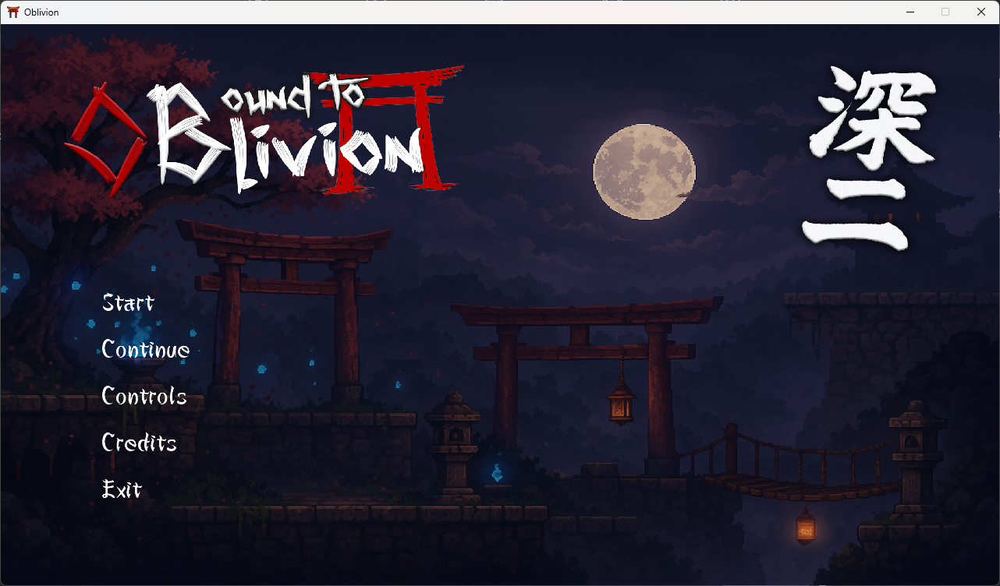
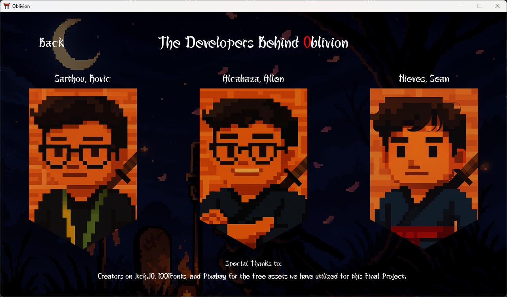
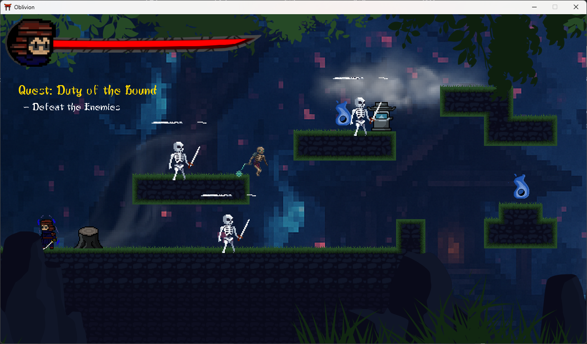
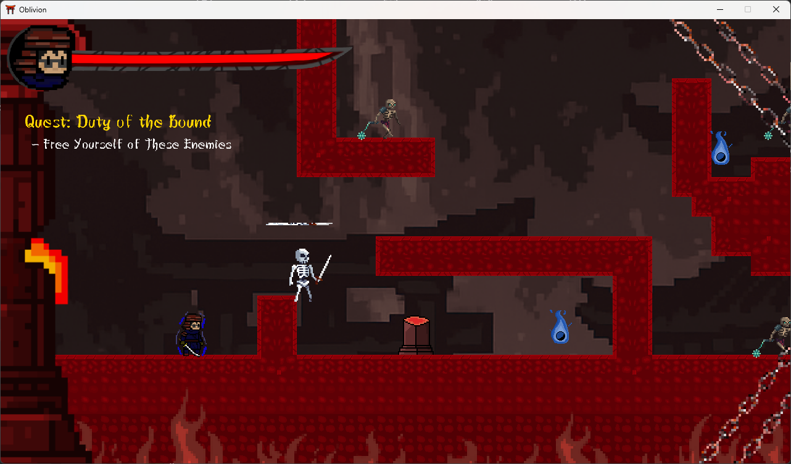

# 🗡️ Bound to Oblivion

**Bound to Oblivion** is a C# action-adventure game developed using **MonoGame**. You play as a samurai cursed to the realm of Oblivion. To escape, you must defeat every enemy — only then will the portal to freedom appear. As you grow closer, the realm grows stronger.

---

## 🧩 Game Summary

> A nameless samurai awakens in a forgotten void.  
> His only hope: slay every corrupted soul in his path.  
> The portal awaits — but the closer it draws, the harder the battle becomes.

---

## 🎮 Game Features

- ⚔️ Samurai-style melee combat
- 🧠 Portal opens only when all enemies are slain
- 🌌 Difficulty scales as the portal nears
- 🎨 Custom-made pixel art and parallax backgrounds

---

# 🎮 Game Screenshots

 - This section showcases various stages of Bound to Oblivion, including the main menu, player interface, enemy encounters, environments, and victory screens. The images highlight both the visual design and core gameplay mechanics, giving a preview of the overall experience.

   <table>
      <tr>
        <td align="center" colspan="2">
          
          <p align="center">Main mMenu</p>
        </td>
        <td align="center" colspan="2">
          
          <p align="center">Developer Team</p>
        </td>
      </tr>

      <tr>
        <td align="center" colspan="2">
          
          <p align="center">First Game Stage</p>
        </td>
        <td align="center" colspan="2">
          
          <p align="center">Second Game Stage</p>
        </td>
      </tr>

## </table>

## 🧑‍💻 Team Members

- **Backend Developer:** Rafhielle Allen Alcabaza
- **Frontend Developer:** Sean Paul Nieves
- **Asset Creator:** Rovic Christopher Sarthou

---

## 🛠️ Tech Stack


- **Content Pipeline:** `.xnb` assets (used .csv for Stage Design), sprite fonts, music, sound effects, parallax layers

---

## 📁 Project Structure (Simplified)

```
BoundToOblivion/                          # Main source code directory
├── Oblivion.sln                          # Visual Studio solution file for the project
├── Game1.cs                              # Main game loop and logic handled here
├── Program.cs                            # Entry point of the game (contains Main method)
├── Content/                              # Raw game assets used before compilation
│   ├── Backgrounds/                      # Background images used in the game
│   ├── Enemies/                          # Sprites or animations of enemy characters
│   ├── Music/                            # Background music files (e.g., MP3 or WAV)
│   ├── Player/                           # Player character sprites or animations
│   └── Sound/                            # Sound effects (e.g., attacks, UI clicks)

Oblivion_Game/                            # Build output directory
├── Release/                              # Release build folder generated by Visual Studio
│   └── net8.0-windows/                   # Platform-specific output for .NET 8 (Windows)
│       ├── Oblivion.exe                  # The compiled game executable
│       ├── Content/                      # Compiled game content (.xnb files)
│       └── Dependencies/                 # Required libraries (MonoGame, SharpDX, etc.)

README.md                                 # Documentation file explaining the project
```

---

## 🖥️ How to Run

### Installation

1.

```bash
git clone https://github.com/cafyrei/Oblivion.git
cd Oblivion
```

2.

```bash
dotnet publish -c Release -o "../Oblivion_Game/Release/net8.0-windows"
```

### 🔧 Prerequisites

- Windows 10 or higher
- [.NET Desktop Runtime 8.0](https://dotnet.microsoft.com/en-us/download/dotnet/8.0)
- DirectX-compatible GPU

### 🚀 Run Executable

#### Option 1: GUI

1. Navigate to:
   ```
   Oblivion_Game/Release/net8.0-windows
   ```
2. Double-click `Oblivion.exe`

#### Option 2: CLI

```bash
cd bin/Release/net8.0-windows/
dotnet Oblivion.dll
```

---

## 📜 Project Use

This game was developed in compliance with academic requirements. It is intended for **educational and portfolio purposes only**.

📘 Project Title: : Bound to Oblivion  
📌 Course: Project : Game Design 1  
🎓 Purpose: : Final Project Compliance

Please contact the developers if you wish to reuse any part of the code, assets, or concept.

---

> _“Only through the sword can I remember who I am.”_
